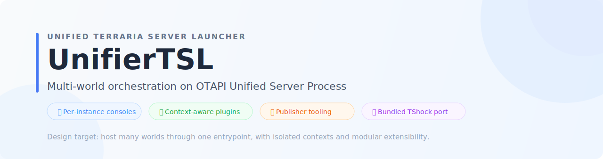
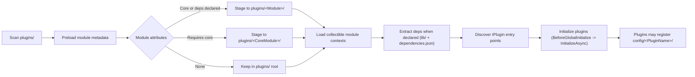

# UnifierTSL

> Languages: [English](./README.md) | [简体中文](./docs/README.zh-cn.md)

<p align="center">
  
</p>

<p align="center">
  <a href="#quick-start"></a>
  <a href="https://github.com/CedaryCat/UnifierTSL/releases"></a>
  <a href="./docs/dev-plugin.md"></a>
  <a href="#architecture"></a>
</p>

<p align="center">
  <a href="https://github.com/CedaryCat/UnifierTSL/actions/workflows/build.yaml"></a>
  <a href="https://github.com/CedaryCat/UnifierTSL/actions/workflows/docs-check.yaml"></a>
  <a href="./src/UnifierTSL.slnx"></a>
  <a href="./LICENSE"></a>
</p>

<p align="center">
  <em>Host multiple Terraria worlds in one launcher process,<br>keep worlds isolated, and keep extending behavior with plugins and publisher tooling on OTAPI USP.</em>
</p>

---

<p align="center">
  
</p>

## 📑 Table of Contents

- [Overview](#overview)
- [Core Capabilities](#core-capabilities)
- [Version Matrix](#version-matrix)
- [Architecture](#architecture)
- [Quick Start](#quick-start)
- [Launcher Reference](#launcher-reference)
- [Publisher Reference](#publisher-reference)
- [Project Layout](#project-layout)
- [Plugin System](#plugin-system)
- [Developer Guide](#developer-guide)
- [Resources](#resources)

---

<a id="overview"></a>
## 📖 Overview

UnifierTSL wraps [OTAPI Unified Server Process](https://github.com/CedaryCat/OTAPI.UnifiedServerProcess) into a runtime you can run directly to host **multiple Terraria worlds in one launcher process**.

The launcher handles world lifecycle, player join routing, and spins up a dedicated console client per world context so each world's I/O stays separate.
Compared with classic single-world servers or packet-routed multi-process world stacks, Unifier keeps join routing, world handoff, and extension hooks in one runtime surface instead of scattering that logic across process boundaries.
`UnifiedServerCoordinator` handles coordination, `UnifierApi.EventHub` carries event traffic, and `PluginHost.PluginOrchestrator` runs plugin hosting.
With shared connection and state surfaces, you can operate worlds together and build tighter cross-world interactions, while policy-based routing and transfer hooks still leave room for world-level fallback behavior.

If you push this model further, you can build more gameplay-driven setups: fully connected multi-instance world clusters, elastic worlds that load or unload region-sized shards on demand, or private worlds tuned per player for logic and resource budgets.
These are achievable directions, not out-of-the-box defaults.
Some heavier implementations may stay outside launcher core, but you can expect practical sample plugins for these patterns to land over time in the `plugins/` ecosystem.

---

<a id="core-capabilities"></a>
## ✨ Core Capabilities

| Feature | Description |
|:--|:--|
| 🖥 **Multi-world coordination** | Run and isolate multiple worlds in a single runtime process |
| 🧱 **Struct-based tile storage** | World tiles use `struct TileData` instead of `ITile` for lower memory use and faster reads/writes |
| 🔀 **Live routing control** | Set default join strategies and re-route players through coordinator events at runtime |
| 🔌 **Plugin hosting** | Load .NET modules from `plugins/` and handle config registration plus dependency extraction |
| 📦 **Collectible module contexts** | `ModuleLoadContext` gives you unloadable plugin domains and staged dependency handling |
| 📝 **Shared logging pipeline** | `UnifierApi.LogCore` supports custom filters, writers, and metadata injectors |
| 🛡 **Bundled TShock port** | Ships with a USP-adapted TShock baseline ready for use |
| 💻 **Per-context console isolation** | Console client processes spawned via named pipe protocol |
| 🚀 **RID-targeted publishing** | Publisher produces reproducible, runtime-specific directory trees |

---

<a id="version-matrix"></a>
## 📊 Version Matrix

<!-- BEGIN:version-matrix -->
The baseline values below come straight from project files and runtime version helpers in this repository:

| Component | Version | Source |
|:--|:--|:--|
| Target framework | `.NET 9.0` | `src/UnifierTSL/*.csproj` |
| Terraria | `1.4.5.5` | `src/UnifierTSL/VersionHelper.cs` (assembly file version from OTAPI/Terraria runtime) |
| OTAPI USP | `1.1.0-pre-release-upstream.25` | `src/UnifierTSL/UnifierTSL.csproj` |

<details>
<summary><strong>TShock and dependency details</strong></summary>

| Item | Value |
|:--|:--|
| Bundled TShock version | `5.9.9` |
| Sync branch | `general-devel` |
| Sync commit | `dab27acb4bf827924803f57918a7023231e43ab3` |
| Source | `src/Plugins/TShockAPI/TShockAPI.csproj` |

Additional dependency baselines:

| Package | Version | Source |
|:--|:--|:--|
| ModFramework | `1.1.15` | `src/UnifierTSL/UnifierTSL.csproj` |
| MonoMod.RuntimeDetour | `25.2.3` | `src/UnifierTSL/UnifierTSL.csproj` |
| Tomlyn | `0.19.0` | `src/UnifierTSL/UnifierTSL.csproj` |
| linq2db | `5.4.1` | `src/UnifierTSL/UnifierTSL.csproj` |
| Microsoft.Data.Sqlite | `9.0.0` | `src/UnifierTSL/UnifierTSL.csproj` |

</details>
<!-- END:version-matrix -->

---

<a id="architecture"></a>
## 🏗 Architecture

<p align="center">
  
</p>

Actual runtime startup flow:

1. `Program.Main` initializes assembly resolver, applies pre-run CLI language overrides, and prints runtime version details.
2. `Initializer.Initialize()` prepares Terraria/USP runtime state and loads core hooks (`UnifiedNetworkPatcher`, `UnifiedServerCoordinator`, `ServerContext` setup).
3. `UnifierApi.InitializeCore(args)` creates `EventHub`, builds `PluginOrchestrator`, runs `PluginHosts.InitializeAllAsync()`, and parses launcher arguments.
4. During argument parsing, each `-server` definition is handled by `AutoStartServer`, which creates `ServerContext` instances and schedules world startup tasks.
5. `UnifierApi.CompleteLauncherInitialization()` resolves interactive listen/password inputs and raises launcher initialized events.
6. `UnifiedServerCoordinator.Launch(...)` opens the shared listener; then title updates, coordinator started event fires, and chat input loop begins.

<details>
<summary><strong>Runtime responsibilities at a glance</strong></summary>

| Component | Responsibilities |
|:--|:--|
| `Program.cs` | Starts the launcher and bootstraps the runtime |
| `UnifierApi` | Initializes event hub, plugin orchestration, and launcher argument handling |
| `UnifiedServerCoordinator` | Manages listening socket, client coordination, and world routing |
| `ServerContext` | Keeps each hosted world's runtime state isolated |
| `PluginHost` + module loader | Handles plugin discovery, loading, and dependency staging |

</details>

### Pick Your Path

| Role | Start Here | Why |
|:--|:--|:--|
| 🖥 Server operator | [Quick Start ↓](#quick-start) | Bring up a usable multi-world host with minimal setup |
| 🔌 Plugin developer | [Plugin Development Guide](./docs/dev-plugin.md) | Build and migrate modules with the same config/events/deps flow the launcher uses |

---

<a id="quick-start"></a>
## 🚀 Quick Start

### Prerequisites

Choose the requirement set that matches how you plan to run UnifierTSL:

| Workflow | Requirements |
|:--|:--|
| **Release bundles only** | [.NET 9 Runtime](https://dotnet.microsoft.com/download/dotnet/9.0) on the target host |
| **From source / Publisher** | [.NET 9 SDK](https://dotnet.microsoft.com/download/dotnet/9.0) + `msgfmt` in `PATH` (for `.mo` files) |

### Option A: Use a Release Bundle

**1.** Download the release asset that matches your platform from [GitHub Releases](https://github.com/CedaryCat/UnifierTSL/releases):

| Platform | File pattern |
|:--|:--|
| Windows | `utsl-<rid>-v<semver>.zip` |
| Linux / macOS | `utsl-<rid>-v<semver>.tar.gz` |

**2.** Extract and launch:

<details>
<summary><strong>Windows (PowerShell)</strong></summary>

```powershell
.\UnifierTSL.exe -port 7777 -password changeme `
  -server "name:S1 worldname:S1 gamemode:3 size:1 evil:0 seed:\"for the worthy\"" `
  -server "name:S2 worldname:S2 gamemode:2 size:2" `
  -joinserver first
```

> **Windows note (SmartScreen/Defender reputation):**
> On some machines, first launch of `app/UnifierTSL.ConsoleClient.exe` may be blocked as an unknown publisher or unrecognized app.
> If this happens, the main launcher console can appear stuck in loading because it keeps retrying the per-world console startup.
> Allow the executable (or trust the extracted folder), then relaunch `UnifierTSL.exe`.

</details>

<details>
<summary><strong>Linux / macOS</strong></summary>

```bash
chmod +x UnifierTSL
./UnifierTSL -port 7777 -password changeme \
  -server "name:S1 worldname:S1 gamemode:3 size:1 evil:0 seed:\"for the worthy\"" \
  -joinserver first
```

</details>

### Option B: Run from Source

Use this path for local debugging, CI integration, or custom bundle output.

**1.** Clone and restore:

```bash
git clone https://github.com/CedaryCat/UnifierTSL.git
cd UnifierTSL
dotnet restore src/UnifierTSL.slnx
```

**2.** Build:

```bash
dotnet build src/UnifierTSL.slnx -c Debug
```

**3.** *(Optional)* Produce local Publisher output:

```bash
dotnet run --project src/UnifierTSL.Publisher/UnifierTSL.Publisher.csproj -- \
  --rid win-x64 \
  --excluded-plugins ExamplePlugin,ExamplePlugin.Features
```

**4.** Run a launcher smoke test:

```bash
dotnet run --project src/UnifierTSL/UnifierTSL.csproj -- \
  -port 7777 -password changeme \
  -server "name:Dev worldname:Dev" \
  -joinserver first
```

> **Note**: Default Publisher output directory is `src/UnifierTSL.Publisher/bin/<Configuration>/net9.0/utsl-<rid>/`.
> `UnifierTSL.ConsoleClient` should only be launched by the launcher; pipe arguments are injected automatically.

---

<a id="launcher-reference"></a>
## 🎮 Launcher Reference

### Command-Line Flags

| Flag(s) | Description | Accepted Values | Default |
|:--|:--|:--|:--|
| `-listen`, `-port` | Coordinator TCP port | Integer | Prompts on STDIN |
| `-password` | Shared client password | Any string | Prompts on STDIN |
| `-autostart`, `-addserver`, `-server` | Add server definitions | Repeatable `key:value` pairs | — |
| `-joinserver` | Default join strategy | `first` / `f` / `random` / `rnd` / `r` | — |
| `-culture`, `-lang`, `-language` | Override Terraria language | Legacy culture ID or name | Host culture |

> **Tip**: If no plugin takes over join behavior through `EventHub.Coordinator.SwitchJoinServer`, use `-joinserver first` or `random`.

### Server Definition Keys

Each `-server` value is whitespace-separated `key:value` pairs parsed by `UnifierApi.AutoStartServer`:

| Key | Purpose | Accepted Values | Default |
|:--|:--|:--|:--|
| `name` | Friendly server identifier | Unique string | *Required* |
| `worldname` | World name to load/generate | Unique string | *Required* |
| `seed` | Generation seed | Any string | — |
| `gamemode` / `difficulty` | World difficulty | `0`–`3`, `normal`, `expert`, `master`, `creative` | `2` |
| `size` | World size | `1`–`3`, `small`, `medium`, `large` | `3` |
| `evil` | World evil type | `0`–`2`, `random`, `corruption`, `crimson` | `0` |

---

<a id="publisher-reference"></a>
## 📦 Publisher Reference

### CLI Flags

| Flag | Description | Values | Default |
|:--|:--|:--|:--|
| `--rid` | Target runtime identifier | e.g. `win-x64`, `linux-x64`, `osx-x64` | *Required* |
| `--excluded-plugins` | Plugin projects to skip | Comma-separated or repeated | — |
| `--output-path` | Base output directory | Absolute or relative path | `src/.../bin/<Config>/net9.0` |
| `--use-rid-folder` | Append `utsl-<rid>` folder | `true` / `false` | `true` |
| `--clean-output-dir` | Clear existing output first | `true` / `false` | `true` |

Publisher builds framework-dependent outputs (`SelfContained=false`).

### Output Lifecycle

<details>
<summary><strong>Initial Publisher output (local)</strong></summary>

Publisher writes a directory tree (not an archive):

```
utsl-<rid>/
├── UnifierTSL(.exe)
├── UnifierTSL.pdb
├── app/
│   ├── UnifierTSL.ConsoleClient(.exe)
│   └── UnifierTSL.ConsoleClient.pdb
├── i18n/
├── lib/
├── plugins/
│   ├── TShockAPI.dll
│   ├── TShockAPI.pdb
│   ├── CommandTeleport.dll
│   └── CommandTeleport.pdb
└── runtimes/
```

</details>

<details>
<summary><strong>Runtime-reorganized plugin layout (after first boot)</strong></summary>

On startup, the module loader may rearrange plugin files into module folders based on attributes (`[CoreModule]`, `[RequiresCoreModule]`, and dependency declarations):

```
plugins/
├── TShockAPI/
│   ├── TShockAPI.dll
│   ├── dependencies.json
│   └── lib/
└── CommandTeleport.dll

config/
├── TShockAPI/
└── CommandTeleport/
```

`dependencies.json` is generated or updated by dependency staging logic during module loading.

</details>

<details>
<summary><strong>CI artifact and release naming</strong></summary>

GitHub Actions uses two naming layers:

| Layer | Pattern |
|:--|:--|
| Workflow artifacts | `utsl-<rid>-<semver>` |
| Release archives (Windows) | `utsl-<rid>-v<semver>.zip` |
| Release archives (Linux/macOS) | `utsl-<rid>-v<semver>.tar.gz` |

</details>

---

<a id="project-layout"></a>
## 🗂 Project Layout

| Component | Purpose |
|:--|:--|
| **Launcher** (`UnifierTSL`) | Runtime entry point for world bootstrap, routing, and coordinator lifecycle |
| **Console Client** (`UnifierTSL.ConsoleClient`) | One console process per world, connected by named pipes |
| **Publisher** (`UnifierTSL.Publisher`) | Builds RID-targeted deployment directory outputs |
| **Plugins** (`src/Plugins/`) | Modules maintained in-repo (TShockAPI, CommandTeleport, examples) |
| **Docs** (`docs/`) | Runtime, plugin, and migration docs |

```text
.
├── src/
│   ├── UnifierTSL.slnx
│   ├── UnifierTSL/
│   │   ├── Module/
│   │   ├── PluginHost/
│   │   ├── Servers/
│   │   ├── Network/
│   │   └── Logging/
│   ├── UnifierTSL.ConsoleClient/
│   ├── UnifierTSL.Publisher/
│   └── Plugins/
│       ├── TShockAPI/
│       ├── CommandTeleport/
│       ├── ExamplePlugin/
│       └── ExamplePlugin.Features/
└── docs/
```

---

<a id="plugin-system"></a>
## 🔌 Plugin System

### Plugin Loading Flow



### Key Concepts

| Concept | Description |
|:--|:--|
| **Module preloading** | `ModuleAssemblyLoader` reads assembly metadata and stages file locations before plugin instantiation |
| **`[CoreModule]`** | Marks a module for a dedicated folder and core module context anchor |
| **`[RequiresCoreModule("...")]`** | Loads this module under the specified core module context |
| **Dependency staging** | Modules with declared dependencies extract into `lib/` and track status in `dependencies.json` |
| **Plugin initialization** | Dotnet host runs `BeforeGlobalInitialize` first, then `InitializeAsync` in sorted plugin order |
| **Config registration** | Configs stored in `config/<PluginName>/`, supports auto-reload (`TriggerReloadOnExternalChange(true)`) |
| **Collectible contexts** | `ModuleLoadContext` enables unloadable plugin domains |

→ Full guide: [Plugin Development Guide](./docs/dev-plugin.md)

---

<a id="developer-guide"></a>
## 🛠 Developer Guide

### Common Commands

```bash
# Restore dependencies
dotnet restore src/UnifierTSL.slnx

# Build (Debug)
dotnet build src/UnifierTSL.slnx -c Debug

# Run launcher with test world
dotnet run --project src/UnifierTSL/UnifierTSL.csproj -- \
  -port 7777 -password changeme -joinserver first

# Produce publisher output for Windows x64
dotnet run --project src/UnifierTSL.Publisher/UnifierTSL.Publisher.csproj -- \
  --rid win-x64

# Run tests (when available)
dotnet test src/UnifierTSL.slnx
```

> **Note**: Automated tests are not included in the repository yet.

### Supported Platforms

| RID | Status |
|:--|:--|
| `win-x64` | ✅ Supported |
| `linux-x64` | ✅ Supported |
| `linux-arm64` | ✅ Supported |
| `linux-arm` | ✅ Supported |
| `osx-x64` | ✅ Supported |

---

<a id="resources"></a>
## 📚 Resources

| Resource | Link |
|:--|:--|
| Developer Overview | [docs/dev-overview.md](./docs/dev-overview.md) |
| Plugin Development Guide | [docs/dev-plugin.md](./docs/dev-plugin.md) |
| OTAPI Unified Server Process | [GitHub](https://github.com/CedaryCat/OTAPI.UnifiedServerProcess) |
| Upstream TShock | [GitHub](https://github.com/Pryaxis/TShock) |
| DeepWiki AI Analysis | [deepwiki.com](https://deepwiki.com/CedaryCat/UnifierTSL) *(reference only)* |

---

<p align="center">
  <sub>Made with ❤️ by the UnifierTSL contributors · Licensed under GPL-3.0</sub>
</p>

