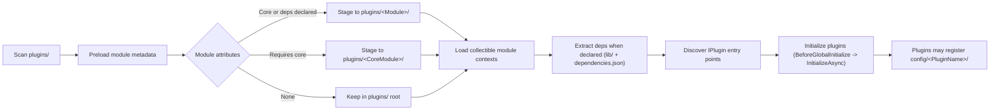

# UnifierTSL

> Languages: [English](./README.md) | [简体中文](./docs/README.zh-cn.md)

<p align="center">
  
</p>

<p align="center">
  <a href="#quick-start"></a>
  <a href="https://github.com/CedaryCat/UnifierTSL/releases"></a>
  <a href="./docs/dev-plugin.md"></a>
  <a href="#architecture"></a>
</p>

<p align="center">
  <a href="https://github.com/CedaryCat/UnifierTSL/actions/workflows/build.yaml"></a>
  <a href="https://github.com/CedaryCat/UnifierTSL/actions/workflows/docs-check.yaml"></a>
  <a href="./src/UnifierTSL.slnx"></a>
  <a href="./LICENSE"></a>
</p>

<p align="center">
  <em>Host multiple Terraria worlds in one launcher process,<br>run each world in its own context in parallel, and handle routing, data interchange, and plugin-driven extension directly inside the same runtime on OTAPI USP.</em>
</p>

---

<p align="center">
  
</p>

## 📑 Table of Contents

- [Overview](#overview)
- [Core Capabilities](#core-capabilities)
- [Version Matrix](#version-matrix)
- [Architecture](#architecture)
- [Quick Start](#quick-start)
- [Launcher Reference](#launcher-reference)
- [Publisher Reference](#publisher-reference)
- [Project Layout](#project-layout)
- [Plugin System](#plugin-system)
- [Developer Guide](#developer-guide)
- [Resources](#resources)

---

<a id="overview"></a>
## 📖 Overview

UnifierTSL wraps [OTAPI Unified Server Process](https://github.com/CedaryCat/OTAPI.UnifiedServerProcess) into a runtime you can run directly to host **multiple Terraria worlds in one launcher process**.

In traditional multi-process multi-world stacks, building a cluster of cooperating worlds usually means extra cross-process routing, state synchronization, and serialization design. Moving players between instances often relies on packet relays and side channels; when plugin-attached data, temporary state, or runtime objects need to cross worlds, problems that could otherwise stay in-process often have to be rewritten as protocols and synchronization flows.

Compared with approaches that push this coordination outside process boundaries, Unifier, based on OTAPI USP, keeps join routing, world switching, and extension hooks inside the same runtime plane and treats cross-world coordination as a first-class concern from the start. The launcher manages multi-world lifecycle centrally, lets each world run independently and in parallel in its own `ServerContext`, and provides a dedicated console per world so I/O stays isolated.
`UnifiedServerCoordinator` handles coordination, `UnifierApi.EventHub` carries event traffic, and `PluginHost.PluginOrchestrator` runs plugin hosting.
This shared listener-and-coordination model reduces the extra overhead and complexity introduced by cross-process relays, making cross-world interaction, data interchange, and unified operations easier while still leaving enough routing control to define the default join target and take over later world-switch flows.

From the player's side, this still behaves like a normal Terraria entry point: clients connect to one shared listener port, and `UnifiedServerCoordinator` routes each connection to the selected world inside the same process. If you push this model further, you can build more gameplay-driven setups: fully connected multi-instance world clusters, elastic worlds that load or unload region-sized shards on demand, or private worlds tuned per player for logic and resource budgets.
These are reachable directions, even though the launcher does not currently ship them as default out-of-the-box features, and heavier implementations like these may stay out of the launcher core itself; you can still expect usable example plugins to land under `plugins/` over time.

---

<a id="core-capabilities"></a>
## ✨ Core Capabilities

| Feature | Description |
|:--|:--|
| 🖥 **Multi-world coordination** | Run and isolate multiple worlds in a single runtime process |
| 🧱 **Struct-based tile storage** | World tiles use `struct TileData` instead of `ITile` for lower memory use and faster reads/writes |
| 🔀 **Live routing control** | Set default join strategies and re-route players through coordinator events at runtime |
| 🔌 **Plugin hosting** | Load .NET modules from `plugins/` and handle config registration plus dependency extraction |
| 📦 **Collectible module contexts** | `ModuleLoadContext` gives you unloadable plugin domains and staged dependency handling |
| 📝 **Shared logging pipeline** | `UnifierApi.LogCore` supports custom filters, writers, and metadata injectors |
| 🛡 **Bundled TShock port** | Ships with a USP-adapted TShock baseline ready for use |
| 💻 **Per-context console isolation** | Independent, auto-reconnecting console I/O windows for each world context, plus semantic readline prompts and live status bars |
| 🚀 **RID-targeted publishing** | Publisher produces reproducible, runtime-specific directory trees |

---

<a id="version-matrix"></a>
## 📊 Version Matrix

<!-- BEGIN:version-matrix -->
The baseline values below come straight from project files and restored package assets used by this repository:

| Component | Version | Source |
|:--|:--|:--|
| Target framework | `.NET 9.0` | `src/UnifierTSL/*.csproj` |
| Terraria | `1.4.5.6` | restored `OTAPI.dll` resolved via `src/UnifierTSL/obj/project.assets.json` (assembly file version) |
| OTAPI USP | `1.1.0-pre-release-upstream.30` | `src/UnifierTSL/UnifierTSL.csproj` |

<details>
<summary><strong>TShock and dependency details</strong></summary>

| Item | Value |
|:--|:--|
| Bundled TShock version | `6.1.0` |
| Sync branch | `general-devel` |
| Sync commit | `1afaeb514343ca547abceeb357654603d1e2a456` |
| Source | `src/Plugins/TShockAPI/TShockAPI.csproj` |

Additional dependency baselines:

| Package | Version | Source |
|:--|:--|:--|
| ModFramework | `1.1.15` | `src/UnifierTSL/UnifierTSL.csproj` |
| MonoMod.RuntimeDetour | `25.2.3` | `src/UnifierTSL/UnifierTSL.csproj` |
| Tomlyn | `0.19.0` | `src/UnifierTSL/UnifierTSL.csproj` |
| linq2db | `5.4.1` | `src/UnifierTSL/UnifierTSL.csproj` |
| Microsoft.Data.Sqlite | `9.0.0` | `src/UnifierTSL/UnifierTSL.csproj` |

</details>
<!-- END:version-matrix -->

---

<a id="architecture"></a>
## 🏗 Architecture

<p align="center">
  
</p>

Actual runtime startup flow:

1. `Program.Main` initializes assembly resolver, applies pre-run CLI language overrides, and prints runtime version details.
2. `Initializer.Initialize()` prepares Terraria/USP runtime state and loads core hooks (`UnifiedNetworkPatcher`, `UnifiedServerCoordinator`, `ServerContext` setup).
3. `UnifierApi.PrepareRuntime(args)` loads `config/config.json`, merges launcher file settings with CLI overrides, and configures the durable logging backend.
4. `UnifierApi.InitializeCore()` creates `EventHub`, builds `PluginOrchestrator`, runs `PluginHosts.InitializeAllAsync()`, installs the launcher console host (`TerminalLauncherConsoleHost` by default), and applies the resolved launcher defaults (join mode + initial auto-start worlds).
5. `UnifierApi.CompleteLauncherInitialization()` resolves interactive listen/password inputs, syncs the effective runtime snapshot, and raises launcher initialized events.
6. `UnifiedServerCoordinator.Launch(...)` opens the shared listener; `UnifierApi.StartRootConfigMonitoring()` then enables root-config hot reload before title updates, coordinator started event, and chat input loop begin.

<details>
<summary><strong>Runtime responsibilities at a glance</strong></summary>

| Component | Responsibilities |
|:--|:--|
| `Program.cs` | Starts the launcher and bootstraps the runtime |
| `UnifierApi` | Initializes event hub, plugin orchestration, and launcher argument handling |
| `UnifiedServerCoordinator` | Manages listening socket, client coordination, and world routing |
| `ServerContext` | Keeps each hosted world's runtime state isolated |
| `PluginHost` + module loader | Handles plugin discovery, loading, and dependency staging |

</details>

### Pick Your Path

| Role | Start Here | Why |
|:--|:--|:--|
| 🖥 Server operator | [Quick Start ↓](#quick-start) | Bring up a usable multi-world host with minimal setup |
| 🔌 Plugin developer | [Plugin Development Guide](./docs/dev-plugin.md) | Build and migrate modules with the same config/events/deps flow the launcher uses |

---

<a id="quick-start"></a>
## 🚀 Quick Start

### Prerequisites

Choose the requirement set that matches how you plan to run UnifierTSL:

| Workflow | Requirements |
|:--|:--|
| **Release bundles only** | [.NET 9 Runtime](https://dotnet.microsoft.com/download/dotnet/9.0) on the target host |
| **From source / Publisher** | [.NET 9 SDK](https://dotnet.microsoft.com/download/dotnet/9.0) + `msgfmt` in `PATH` (for `.mo` files) |

### Option A: Use a Release Bundle

**1.** Download the release asset that matches your platform from [GitHub Releases](https://github.com/CedaryCat/UnifierTSL/releases):

| Platform | File pattern |
|:--|:--|
| Windows | `utsl-<rid>-v<semver>.zip` |
| Linux / macOS | `utsl-<rid>-v<semver>.tar.gz` |

**2.** Extract and launch:

<details>
<summary><strong>Windows (PowerShell)</strong></summary>

```powershell
.\UnifierTSL.exe -port 7777 -password changeme `
  -server "name:S1 worldname:S1 gamemode:3 size:1 evil:0 seed:\"for the worthy\"" `
  -server "name:S2 worldname:S2 gamemode:2 size:2" `
  -joinserver first
```

> **Windows note (SmartScreen/Defender reputation):**
> On some machines, first launch of `app/UnifierTSL.ConsoleClient.exe` may be blocked as an unknown publisher or unrecognized app.
> If this happens, the main launcher console can appear stuck in loading because it keeps retrying the per-world console startup.
> Allow the executable (or trust the extracted folder), then relaunch `UnifierTSL.exe`.

</details>

<details>
<summary><strong>Linux / macOS</strong></summary>

```bash
chmod +x UnifierTSL
./UnifierTSL -port 7777 -password changeme \
  -server "name:S1 worldname:S1 gamemode:3 size:1 evil:0 seed:\"for the worthy\"" \
  -joinserver first
```

</details>

### Option B: Run from Source

Use this path for local debugging, CI integration, or custom bundle output.

**1.** Clone and restore:

```bash
git clone https://github.com/CedaryCat/UnifierTSL.git
cd UnifierTSL
dotnet restore src/UnifierTSL.slnx
```

**2.** Build:

```bash
dotnet build src/UnifierTSL.slnx -c Debug
```

**3.** *(Optional)* Produce local Publisher output:

```bash
dotnet run --project src/UnifierTSL.Publisher/UnifierTSL.Publisher.csproj -- \
  --excluded-plugins ExamplePlugin,ExamplePlugin.Features
```

If `--rid` is omitted, Publisher infers the current host RID automatically. For reproducible packaging or cross-host instructions, passing `--rid` explicitly is still recommended, for example `--rid win-x64`.

**4.** Run a launcher smoke test:

```bash
dotnet run --project src/UnifierTSL/UnifierTSL.csproj -- \
  -port 7777 -password changeme \
  -server "name:Dev worldname:Dev" \
  -joinserver first
```

> **Note**: Default Publisher output directory is `src/UnifierTSL.Publisher/bin/<Configuration>/net9.0/utsl-<rid>/`.
> `UnifierTSL.ConsoleClient` should only be launched by the launcher; pipe arguments are injected automatically.

**5.** *(Optional, simplest Visual Studio debug flow)* Use the bundled launch profiles:

1. Set startup project to `UnifierTSL.Publisher` and run it once.
2. The bundled Publisher profile writes to `src/UnifierTSL.Publisher/bin/Debug/net9.0/utsl-publish/` because it uses `--use-rid-folder false --clean-output-dir false --output-path "utsl-publish"`.
3. Switch startup project to `UnifierTSL`, choose the `Executable` launch profile, and start debugging.
4. That profile runs the published launcher from `utsl-publish` and debugs the published program directly.

### What Happens on First Boot

- `config/config.json` is created automatically and stores the effective launcher startup snapshot; CLI arguments still take priority for the current launch.
- Plugin configs live under `config/<PluginName>/`. For the bundled TShock port, that root is `config/TShockAPI/`; it is also the save location for other TShock runtime files such as `tshock.sqlite` when SQLite is enabled, so this folder effectively plays the same role as the standalone TShock `tshock/` directory.
- Published bundles start with a flat `plugins/` directory; on startup, the module loader may reorganize modules into subfolders when dependency or core-module metadata requires it.
- A healthy startup means the shared listener bound successfully, the configured worlds started, the launcher status output began updating, and, under the default console I/O implementation, a dedicated console window appeared for each world.

### Bundled TShock Notes

- The bundled TShock here is a migration for the UnifierTSL / OTAPI USP runtime. Its lower-level logic is reimplemented by prioritizing UTSL/USP-native runtime APIs, event surfaces, packet models, and similar built-in capabilities, without maintaining an extra compatibility layer, while still aiming to keep the behavior and operator experience of TShock's higher-level features as close to upstream TShock as possible within a multi-world, single-process runtime model.
- This port is maintained to keep tracking upstream TShock. You can inspect the current migration baseline directly in `src/Plugins/TShockAPI/TShockAPI.csproj`, especially `MainlineSyncBranch`, `MainlineSyncCommit`, and `MainlineVersion`.
- Launcher settings stay in `config/config.json`, while the bundled TShock uses its own config-and-data root under `config/TShockAPI/`, separate from the launcher root config. This is also where other TShock runtime files live, such as `tshock.sqlite` when SQLite is enabled, so this directory effectively plays the same role as the standalone TShock `tshock/` folder.
- `config/TShockAPI/config.json` holds global TShock defaults, while `config/TShockAPI/config.override.json` stores per-server override patches keyed by configured server name, for example `"S1": { "MaxSlots": 16 }`. `config/TShockAPI/sscconfig.json` remains a separate file for SSC settings.
- Because the runtime hosts multiple worlds at once, some TShock data access that is usually implicit in a single-world flow becomes explicit here; for example, warp-related code paths resolve entries with an explicit `worldId` instead of only relying on the current global world state.
- Editing `config.json` or `config.override.json` externally updates the watched config handles and reapplies runtime TShock server settings. `/reload` still matters because it additionally refreshes permissions, regions, bans, whitelist-backed state, and the classic TShock reload flow. Some changes still require a restart.
- Finally, thanks to the TShock project and its contributors for the functionality, design work, and ecosystem this migration builds upon.

---

<a id="launcher-reference"></a>
## 🎮 Launcher Reference

### Command-Line Flags

| Flag(s) | Description | Accepted Values | Default |
|:--|:--|:--|:--|
| `-listen`, `-port` | Coordinator TCP port | Integer | Prompts on STDIN |
| `-password` | Shared client password | Any string | Prompts on STDIN |
| `-autostart`, `-addserver`, `-server` | Add server definitions | Repeatable `key:value` pairs | — |
| `-servermerge`, `--server-merge`, `--auto-start-merge` | How CLI `-server` entries merge with config | `replace` / `overwrite` / `append` | `replace` |
| `-joinserver` | Default join strategy | `first` / `f` / `random` / `rnd` / `r` | — |
| `-logmode`, `--log-mode` | Durable launcher log backend | `txt` / `none` / `sqlite` | `txt` |
| `-colorful`, `--colorful`, `--no-colorful` | Toggle vivid ANSI status-bar rendering on interactive terminals | `true` / `false`, `on` / `off`, `1` / `0`; `--no-colorful` disables | `true` |
| `-culture`, `-lang`, `-language` | Override Terraria language | Legacy culture ID or name | Host culture |

> **Tip**: If no plugin takes over join behavior through `EventHub.Coordinator.SwitchJoinServer`, use `-joinserver first` or `random`.

### Launcher Config File

The launcher root config is `config/config.json`. It is separate from plugin configs (`config/<PluginName>/...`), and the legacy root-level `config.json` is intentionally ignored.

Startup precedence is:

1. `config/config.json`
2. CLI overrides (then persisted back to `config/config.json` as the effective startup snapshot)
3. Interactive prompts for a missing port/password

On interactive terminals, missing port/password prompts use semantic readline with ghost text, rotating suggestions, and live validation/status lines; non-interactive hosts fall back automatically.

`launcher.consoleStatus` controls command-line status rendering. `launcher.colorfulConsoleStatus` still toggles the vivid ANSI palette, while `launcher.consoleStatus.bandwidthUnit` selects `bytes` (`KB/s -> MB/s -> GB/s -> TB/s`, default) or `bits` (`Kbps -> Mbps -> Gbps -> Tbps`), and `launcher.consoleStatus.bandwidthRolloverThreshold` controls when the formatter promotes to the next unit family step (default: `500.0`).

<details>
<summary><strong>Default console-status values</strong></summary>

| Key | Unit | Default | Description |
|:--|:--|:--|:--|
| `targetUps` | UPS | `60.0` | Target update rate used as the baseline for TPS health checks |
| `healthyUpsDeviation` | UPS delta | `2.0` | Maximum absolute deviation from `targetUps` that still counts as healthy |
| `warningUpsDeviation` | UPS delta | `5.0` | Maximum absolute deviation from `targetUps` that still counts as warning before turning bad |
| `utilHealthyMax` | ratio (`0.0`-`1.0`) | `0.55` | Highest busy-utilization value that still counts as healthy |
| `utilWarningMax` | ratio (`0.0`-`1.0`) | `0.80` | Highest busy-utilization value that still counts as warning before turning bad |
| `onlineWarnRemainingSlots` | slots | `5` | Remaining player slots at or below this value turn the online indicator to warning |
| `onlineBadRemainingSlots` | slots | `0` | Remaining player slots at or below this value turn the online indicator to bad/full |
| `bandwidthUnit` | enum | `bytes` | Bandwidth display family: `bytes` (`KB/s -> MB/s -> GB/s -> TB/s`) or `bits` (`Kbps -> Mbps -> Gbps -> Tbps`) |
| `bandwidthRolloverThreshold` | current display unit | `500.0` | Value at or above this threshold promotes the formatter to the next bandwidth unit |
| `upWarnKBps` | KB/s | `800.0` | Server upstream bandwidth threshold that turns the network indicator to warning |
| `upBadKBps` | KB/s | `1600.0` | Server upstream bandwidth threshold that turns the network indicator to bad |
| `downWarnKBps` | KB/s | `50.0` | Server downstream bandwidth threshold that turns the network indicator to warning |
| `downBadKBps` | KB/s | `100.0` | Server downstream bandwidth threshold that turns the network indicator to bad |
| `launcherUpWarnKBps` | KB/s | `2400.0` | Launcher upstream bandwidth threshold that turns the network indicator to warning |
| `launcherUpBadKBps` | KB/s | `4800.0` | Launcher upstream bandwidth threshold that turns the network indicator to bad |
| `launcherDownWarnKBps` | KB/s | `150.0` | Launcher downstream bandwidth threshold that turns the network indicator to warning |
| `launcherDownBadKBps` | KB/s | `300.0` | Launcher downstream bandwidth threshold that turns the network indicator to bad |

</details>

After `UnifiedServerCoordinator.Launch(...)` succeeds, the launcher begins watching `config/config.json` for safe hot reloads:

- Live-applied: `launcher.serverPassword`, `launcher.joinServer`, additive `launcher.autoStartServers`, `launcher.listenPort` (listener rebind), `launcher.colorfulConsoleStatus`, `launcher.consoleStatus`

### Server Definition Keys

Each `-server` value is whitespace-separated `key:value` pairs parsed by `LauncherRuntimeOps` during startup config merge:

| Key | Purpose | Accepted Values | Default |
|:--|:--|:--|:--|
| `name` | Friendly server identifier | Unique string | *Required* |
| `worldname` | World name to load/generate | Unique string | *Required* |
| `seed` | Generation seed | Any string | — |
| `gamemode` / `difficulty` | World difficulty | `0`–`3`, `normal`, `expert`, `master`, `creative` | `master` |
| `size` | World size | `1`–`3`, `small`, `medium`, `large` | `large` |
| `evil` | World evil type | `0`–`2`, `random`, `corruption`, `crimson` | `random` |

`-servermerge` behavior:

- `replace` (default): clean replacement; config entries not present in CLI are removed.
- `overwrite`: keep config entries, but CLI entries with the same `name` replace them.
- `append`: keep config entries, only add CLI entries whose `name` does not exist.
- World-name conflicts are resolved by priority (higher-priority entry kept, lower-priority entry ignored with warning).

---

<a id="publisher-reference"></a>
## 📦 Publisher Reference

### CLI Flags

| Flag | Description | Values | Default |
|:--|:--|:--|:--|
| `--rid` | Target runtime identifier. If omitted, Publisher infers the current host RID; explicit input is still recommended | e.g. `win-x64`, `linux-x64`, `osx-x64` | Auto-detected from current host |
| `--excluded-plugins` | Plugin projects to skip | Comma-separated or repeated | — |
| `--output-path` | Base output directory | Absolute or relative path | `src/.../bin/<Config>/net9.0` |
| `--use-rid-folder` | Append `utsl-<rid>` folder | `true` / `false` | `true` |
| `--clean-output-dir` | Clear existing output first | `true` / `false` | `true` |

Publisher builds framework-dependent outputs (`SelfContained=false`).

### Output Lifecycle

<details>
<summary><strong>Initial Publisher output (local)</strong></summary>

Publisher writes a directory tree (not an archive):

```
utsl-<rid>/
├── UnifierTSL(.exe)
├── UnifierTSL.pdb
├── app/
│   ├── UnifierTSL.ConsoleClient(.exe)
│   └── UnifierTSL.ConsoleClient.pdb
├── i18n/
├── lib/
├── plugins/
│   ├── TShockAPI.dll
│   ├── TShockAPI.pdb
│   ├── CommandTeleport.dll
│   └── CommandTeleport.pdb
└── runtimes/
```

</details>

<details>
<summary><strong>Runtime-reorganized plugin layout (after first boot)</strong></summary>

On startup, the module loader may rearrange plugin files into module folders based on attributes (`[CoreModule]`, `[RequiresCoreModule]`, and dependency declarations):

```
plugins/
├── TShockAPI/
│   ├── TShockAPI.dll
│   ├── dependencies.json
│   └── lib/
└── CommandTeleport.dll

config/
├── config.json
├── TShockAPI/
└── CommandTeleport/
```

`dependencies.json` is generated or updated by dependency staging logic during module loading.

</details>

<details>
<summary><strong>CI artifact and release naming</strong></summary>

GitHub Actions uses two naming layers:

| Layer | Pattern |
|:--|:--|
| Workflow artifacts | `utsl-<rid>-<semver>` |
| Release archives (Windows) | `utsl-<rid>-v<semver>.zip` |
| Release archives (Linux/macOS) | `utsl-<rid>-v<semver>.tar.gz` |

</details>

---

<a id="project-layout"></a>
## 🗂 Project Layout

| Component | Purpose |
|:--|:--|
| **Launcher** (`UnifierTSL`) | Runtime entry point for world bootstrap, routing, and coordinator lifecycle |
| **Console Client** (`UnifierTSL.ConsoleClient`) | One console process per world, connected by named pipes |
| **Publisher** (`UnifierTSL.Publisher`) | Builds RID-targeted deployment directory outputs |
| **Plugins** (`src/Plugins/`) | Modules maintained in-repo (TShockAPI, CommandTeleport, examples) |
| **Docs** (`docs/`) | Runtime, plugin, and migration docs |

```text
.
├── src/
│   ├── UnifierTSL.slnx
│   ├── UnifierTSL/
│   │   ├── Module/
│   │   ├── PluginHost/
│   │   ├── Servers/
│   │   ├── Network/
│   │   └── Logging/
│   ├── UnifierTSL.ConsoleClient/
│   ├── UnifierTSL.Publisher/
│   └── Plugins/
│       ├── TShockAPI/
│       ├── CommandTeleport/
│       ├── ExamplePlugin/
│       └── ExamplePlugin.Features/
└── docs/
```

---

<a id="plugin-system"></a>
## 🔌 Plugin System

### Plugin Loading Flow


```mermaid
graph LR
    A["Scan plugins/"] --> B["Preload module metadata"]
    B --> C{"Module attributes"}
    C -->|Core or deps declared| D["Stage to plugins/&lt;Module&gt;/"]
    C -->|Requires core| E["Stage to plugins/&lt;CoreModule&gt;/"]
    C -->|None| F["Keep in plugins/ root"]
    D --> G["Load collectible module contexts"]
    E --> G
    F --> G
    G --> H["Extract deps when declared (lib/ + dependencies.json)"]
    H --> I["Discover IPlugin entry points"]
    I --> J["Initialize plugins (BeforeGlobalInitialize -> InitializeAsync)"]
    J --> K["Plugins may register config/&lt;PluginName&gt;/"]
```

### Key Concepts

| Concept | Description |
|:--|:--|
| **Module preloading** | `ModuleAssemblyLoader` reads assembly metadata and stages file locations before plugin instantiation |
| **`[CoreModule]`** | Marks a module for a dedicated folder and core module context anchor |
| **`[RequiresCoreModule("...")]`** | Loads this module under the specified core module context |
| **Dependency staging** | Modules with declared dependencies extract into `lib/` and track status in `dependencies.json` |
| **Plugin initialization** | Dotnet host runs `BeforeGlobalInitialize` first, then `InitializeAsync` in sorted plugin order |
| **Config registration** | Configs stored in `config/<PluginName>/`, supports auto-reload (`TriggerReloadOnExternalChange(true)`) |
| **Collectible contexts** | `ModuleLoadContext` enables unloadable plugin domains |

→ Full guide: [Plugin Development Guide](./docs/dev-plugin.md)

---

<a id="developer-guide"></a>
## 🛠 Developer Guide

### Common Commands

```bash
# Restore dependencies
dotnet restore src/UnifierTSL.slnx

# Build (Debug)
dotnet build src/UnifierTSL.slnx -c Debug

# Run launcher with test world
dotnet run --project src/UnifierTSL/UnifierTSL.csproj -- \
  -port 7777 -password changeme -joinserver first

# Produce publisher output for the current host (RID auto-detected)
dotnet run --project src/UnifierTSL.Publisher/UnifierTSL.Publisher.csproj -- \
  --excluded-plugins ExamplePlugin,ExamplePlugin.Features

# Produce publisher output for a specific RID (recommended for reproducible packaging)
dotnet run --project src/UnifierTSL.Publisher/UnifierTSL.Publisher.csproj -- \
  --rid win-x64
```

### Supported Platforms

This table reflects the currently maintained/documented packaging targets, not every RID Publisher can attempt to infer.

| RID | Status |
|:--|:--|
| `win-x64` | ✅ Supported |
| `linux-x64` | ✅ Supported |
| `linux-arm64` | ❌ Not supported yet |
| `linux-arm` | ⚠️ Partial support / needs manual verification |
| `osx-x64` | ✅ Supported |

---

<a id="resources"></a>
## 📚 Resources

| Resource | Link |
|:--|:--|
| Developer Overview | [docs/dev-overview.md](./docs/dev-overview.md) |
| Plugin Development Guide | [docs/dev-plugin.md](./docs/dev-plugin.md) |
| Branch Workflow Guide | [docs/branch-setup-guide.md](./docs/branch-setup-guide.md) |
| Branch Workflow Quick Reference | [docs/branch-strategy-quick-reference.md](./docs/branch-strategy-quick-reference.md) |
| OTAPI Unified Server Process | [GitHub](https://github.com/CedaryCat/OTAPI.UnifiedServerProcess) |
| Upstream TShock | [GitHub](https://github.com/Pryaxis/TShock) |
| DeepWiki AI Analysis | [deepwiki.com](https://deepwiki.com/CedaryCat/UnifierTSL) *(reference only)* |

---

<p align="center">
  <sub>Made with ❤️ by the UnifierTSL contributors · Licensed under GPL-3.0</sub>
</p>
