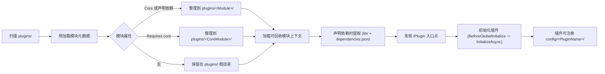

# UnifierTSL

> Languages: [English](../README.md) | [简体中文](./README.zh-cn.md)

<p align="center">
  
</p>

<p align="center">
  <a href="#quick-start"></a>
  <a href="https://github.com/CedaryCat/UnifierTSL/releases"></a>
  <a href="./dev-plugin.zh-cn.md"></a>
  <a href="#architecture"></a>
</p>

<p align="center">
  <a href="https://github.com/CedaryCat/UnifierTSL/actions/workflows/build.yaml"></a>
  <a href="https://github.com/CedaryCat/UnifierTSL/actions/workflows/docs-check.yaml"></a>
  <a href="../src/UnifierTSL.slnx"></a>
  <a href="../LICENSE"></a>
</p>

<p align="center">
  <em>在一个启动器进程里运行多个 Terraria 世界，<br>保持世界级隔离，并基于 OTAPI USP 用插件和发布工具链持续扩展能力。</em>
</p>

---

<p align="center">
  
</p>

## 📑 目录

- [概览](#overview)
- [核心能力](#core-capabilities)
- [版本矩阵](#version-matrix)
- [架构](#architecture)
- [快速开始](#quick-start)
- [启动器参考](#launcher-reference)
- [Publisher 参考](#publisher-reference)
- [项目结构](#project-layout)
- [插件系统](#plugin-system)
- [开发者指南](#developer-guide)
- [资源](#resources)

---

<a id="overview"></a>
## 📖 概览

UnifierTSL 把 [OTAPI Unified Server Process](https://github.com/CedaryCat/OTAPI.UnifiedServerProcess) 封装成可直接使用的运行时，让你在**一个启动器进程里托管多个 Terraria 世界**。

启动器负责世界启停、玩家入服路由，并为每个世界上下文拉起独立控制台客户端，保证各世界 I/O 互不干扰。
和经典单世界服务器、或基于数据包路由的多进程多世界方案相比，Unifier 把入服路由、世界切换和扩展钩子都放在同一个运行时平面里，不需要把关键逻辑拆到进程边界外。
`UnifiedServerCoordinator` 负责总体协调，`UnifierApi.EventHub` 传递事件流，`PluginHost.PluginOrchestrator` 负责插件宿主编排。
这种共享连接与状态平面的方式，既方便统一运维和跨世界联动，也保留了策略化路由与转服钩子，方便按世界做兜底策略。

如果继续把这套模型往前推，你可以做出更偏玩法的形态：完全互通的多实例世界集群、按需加载/卸载区域分片的弹性世界，或为单个玩家定制逻辑和资源预算的私人世界。
这些是可达方向，不是开箱即用的默认能力。
这类较重实现不一定会放进启动器核心，但后续可以期待在 `plugins/` 里陆续补上对应的可用示例插件。

---

<a id="core-capabilities"></a>
## ✨ 核心能力

| 特性 | 描述 |
|:--|:--|
| 🖥 **多世界协调** | 在一个运行时进程里同时拉起并隔离多个世界 |
| 🧱 **结构体瓦片存储** | 世界图格使用 `struct TileData` 取代 `ITile`，降低内存占用并提升读写效率 |
| 🔀 **实时路由控制** | 可设置默认入服策略，也能通过协调器事件动态重路由玩家 |
| 🔌 **插件托管** | 从 `plugins/` 加载 .NET 模块，并处理配置注册与依赖分发 |
| 📦 **可回收模块上下文** | `ModuleLoadContext` 提供可卸载插件域，并支持分阶段依赖处理 |
| 📝 **统一日志管线** | `UnifierApi.LogCore` 支持自定义过滤器、写入器与元数据注入 |
| 🛡 **内置 TShock 移植基线** | 内置适配 USP 的 TShock 基线，开箱可用 |
| 💻 **上下文级控制台隔离** | 通过命名管道协议为每个世界拉起独立控制台客户端进程 |
| 🚀 **按 RID 发布** | Publisher 生成可复现、面向目标运行时的目录结构 |

---

<a id="version-matrix"></a>
## 📊 版本矩阵

下面这些基线值直接来自仓库内项目文件与运行时版本辅助逻辑：

| 组件 | 版本 | 来源 |
|:--|:--|:--|
| 目标框架 | `.NET 9.0` | `src/UnifierTSL/*.csproj` |
| Terraria | `1.4.5.5` | `src/UnifierTSL/VersionHelper.cs`（从 OTAPI/Terraria 运行时程序集文件版本读取） |
| OTAPI USP | `1.1.0-pre-release-upstream.23` | `src/UnifierTSL/UnifierTSL.csproj` |

<details>
<summary><strong>TShock 与依赖详情</strong></summary>

| 项目 | 值 |
|:--|:--|
| 内置 TShock 版本 | `5.9.9` |
| 同步分支 | `general-devel` |
| 同步提交 | `a41e1f2046c5cd2f0be9f590efbbf1cda58aea5f` |
| 来源 | `src/Plugins/TShockAPI/TShockAPI.csproj` |

附加依赖版本：

| 包 | 版本 | 来源 |
|:--|:--|:--|
| ModFramework | `1.1.15` | `src/UnifierTSL/UnifierTSL.csproj` |
| MonoMod.RuntimeDetour | `25.2.3` | `src/UnifierTSL/UnifierTSL.csproj` |
| Tomlyn | `0.19.0` | `src/UnifierTSL/UnifierTSL.csproj` |
| linq2db | `5.4.1` | `src/UnifierTSL/UnifierTSL.csproj` |
| Microsoft.Data.Sqlite | `9.0.0` | `src/UnifierTSL/UnifierTSL.csproj` |

</details>

---

<a id="architecture"></a>
## 🏗 架构

<p align="center">
  
</p>

运行时实际启动顺序如下：

1. `Program.Main` 初始化程序集解析器，应用启动前 CLI 语言覆盖，并输出运行时版本信息。
2. `Initializer.Initialize()` 准备 Terraria/USP 运行时状态，加载核心钩子（`UnifiedNetworkPatcher`、`UnifiedServerCoordinator`、`ServerContext` 初始化）。
3. `UnifierApi.InitializeCore(args)` 创建 `EventHub`、构建 `PluginOrchestrator`、执行 `PluginHosts.InitializeAllAsync()`，并解析启动参数。
4. 参数解析期间，每个 `-server` 定义由 `AutoStartServer` 处理，创建 `ServerContext` 实例并调度世界启动任务。
5. `UnifierApi.CompleteLauncherInitialization()` 补全交互式监听端口/密码输入，并触发启动器初始化事件。
6. `UnifiedServerCoordinator.Launch(...)` 打开共享监听；随后更新标题、触发协调器已启动事件并进入聊天输入循环。

<details>
<summary><strong>运行时组件分工</strong></summary>

| 组件 | 职责 |
|:--|:--|
| `Program.cs` | 启动启动器并完成运行时引导 |
| `UnifierApi` | 初始化事件中心、插件编排和启动参数处理 |
| `UnifiedServerCoordinator` | 管理监听套接字、客户端协调和跨世界路由 |
| `ServerContext` | 维护每个托管世界各自隔离的运行时状态 |
| `PluginHost` + 模块加载器 | 负责插件发现、加载和依赖分发 |

</details>

### 角色入口

| 角色 | 从这里开始 | 原因 |
|:--|:--|:--|
| 🖥 服主/运维 | [快速开始 ↓](#quick-start) | 用最少配置把多世界宿主先跑起来 |
| 🔌 插件开发者 | [插件开发指南](./dev-plugin.zh-cn.md) | 沿用启动器同源的配置/事件/依赖流程来开发和迁移模块 |

---

<a id="quick-start"></a>
## 🚀 快速开始

### 前置要求

按你的使用方式准备对应依赖：

| 工作流 | 要求 |
|:--|:--|
| **仅使用发布包** | 目标主机安装 [.NET 9 Runtime](https://dotnet.microsoft.com/download/dotnet/9.0) |
| **源码运行 / Publisher** | 安装 [.NET 9 SDK](https://dotnet.microsoft.com/download/dotnet/9.0) 且 `PATH` 中可用 `msgfmt`（用于 `.mo` 文件） |

### 方案 A：使用发布包

**1.** 从 [GitHub Releases](https://github.com/CedaryCat/UnifierTSL/releases) 下载与你平台匹配的发布资产：

| 平台 | 文件模式 |
|:--|:--|
| Windows | `utsl-<rid>-v<semver>.zip` |
| Linux / macOS | `utsl-<rid>-v<semver>.tar.gz` |

**2.** 解压并启动：

<details>
<summary><strong>Windows (PowerShell)</strong></summary>

```powershell
.\UnifierTSL.exe -lang 7 -port 7777 -password changeme `
  -server "name:S1 worldname:S1 gamemode:3 size:1 evil:0 seed:\"for the worthy\"" `
  -server "name:S2 worldname:S2 gamemode:2 size:2" `
  -joinserver first
```

> **Windows 提示（SmartScreen/Defender 信誉）：**
> 在部分机器上，首次启动 `app/UnifierTSL.ConsoleClient.exe` 可能被识别为未知发布者或未识别应用并被拦截。
> 如果发生，主启动器控制台可能看起来卡在加载状态，因为它会持续重试拉起每世界控制台进程。
> 允许该可执行文件（或信任解压目录）后，重新启动 `UnifierTSL.exe`。

</details>

<details>
<summary><strong>Linux / macOS</strong></summary>

```bash
chmod +x UnifierTSL
./UnifierTSL -lang 7 -port 7777 -password changeme \
  -server "name:S1 worldname:S1 gamemode:3 size:1 evil:0 seed:\"for the worthy\"" \
  -joinserver first
```

</details>

### 方案 B：从源码运行

如果你要本地调试、接 CI，或产出自定义发布包，走这个方式。

**1.** 克隆并还原依赖：

```bash
git clone https://github.com/CedaryCat/UnifierTSL.git
cd UnifierTSL
dotnet restore src/UnifierTSL.slnx
```

**2.** 构建：

```bash
dotnet build src/UnifierTSL.slnx -c Debug
```

**3.** （可选）生成本地 Publisher 产物：

```bash
dotnet run --project src/UnifierTSL.Publisher/UnifierTSL.Publisher.csproj -- \
  --rid win-x64 \
  --excluded-plugins ExamplePlugin,ExamplePlugin.Features
```

**4.** 做一次启动冒烟测试：

```bash
dotnet run --project src/UnifierTSL/UnifierTSL.csproj -- \
  -port 7777 -password changeme \
  -server "name:Dev worldname:Dev" \
  -joinserver first
```

> **说明**：Publisher 默认输出目录为 `src/UnifierTSL.Publisher/bin/<Configuration>/net9.0/utsl-<rid>/`。
> `UnifierTSL.ConsoleClient` 只需要由启动器拉起，管道参数会自动注入。

---

<a id="launcher-reference"></a>
## 🎮 启动器参考

### 命令行参数

| 参数 | 描述 | 可接受值 | 默认值 |
|:--|:--|:--|:--|
| `-listen`, `-port` | 协调器 TCP 端口 | 整数 | 从 STDIN 交互读取 |
| `-password` | 共享客户端密码 | 任意字符串 | 从 STDIN 交互读取 |
| `-autostart`, `-addserver`, `-server` | 添加服务器定义 | 可重复 `key:value` 组 | — |
| `-joinserver` | 默认入服策略 | `first` / `f` / `random` / `rnd` / `r` | — |
| `-culture`, `-lang`, `-language` | 覆盖 Terraria 语言 | 旧 culture ID 或名称 | 主机 culture |

> **提示**：如果插件没有通过 `EventHub.Coordinator.SwitchJoinServer` 接管入服，建议直接使用 `-joinserver first` 或 `random`。

### 服务器定义键

每个 `-server` 值由空白分隔的 `key:value` 组成，实际由 `UnifierApi.AutoStartServer` 解析：

| 键 | 用途 | 可接受值 | 默认值 |
|:--|:--|:--|:--|
| `name` | 友好服务器标识 | 唯一字符串 | *必填* |
| `worldname` | 加载或生成的世界名 | 唯一字符串 | *必填* |
| `seed` | 生成种子 | 任意字符串 | — |
| `gamemode` / `difficulty` | 世界难度 | `0`–`3`, `normal`, `expert`, `master`, `creative` | `2` |
| `size` | 世界尺寸 | `1`–`3`, `small`, `medium`, `large` | `3` |
| `evil` | 世界邪恶类型 | `0`–`2`, `random`, `corruption`, `crimson` | `0` |

---

<a id="publisher-reference"></a>
## 📦 Publisher 参考

### CLI 参数

| 参数 | 描述 | 取值 | 默认值 |
|:--|:--|:--|:--|
| `--rid` | 目标运行时标识符 | 例如 `win-x64`, `linux-x64`, `osx-x64` | *必填* |
| `--excluded-plugins` | 要跳过的插件项目 | 逗号分隔或重复传入 | — |
| `--output-path` | 输出根目录 | 绝对或相对路径 | `src/.../bin/<Config>/net9.0` |
| `--use-rid-folder` | 是否追加 `utsl-<rid>` 子目录 | `true` / `false` | `true` |
| `--clean-output-dir` | 输出前清空已有目录 | `true` / `false` | `true` |

Publisher 生成 framework-dependent 产物（`SelfContained=false`）。

### 输出生命周期

<details>
<summary><strong>Publisher 初始输出（本地）</strong></summary>

Publisher 会生成目录树（不是归档）：

```
utsl-<rid>/
├── UnifierTSL(.exe)
├── UnifierTSL.pdb
├── app/
│   ├── UnifierTSL.ConsoleClient(.exe)
│   └── UnifierTSL.ConsoleClient.pdb
├── i18n/
├── lib/
├── plugins/
│   ├── TShockAPI.dll
│   ├── TShockAPI.pdb
│   ├── CommandTeleport.dll
│   └── CommandTeleport.pdb
└── runtimes/
```

</details>

<details>
<summary><strong>首次启动后重排的插件布局</strong></summary>

启动阶段，模块加载器会根据属性（`[CoreModule]`、`[RequiresCoreModule]`、依赖声明）重排插件文件：

```
plugins/
├── TShockAPI/
│   ├── TShockAPI.dll
│   ├── dependencies.json
│   └── lib/
└── CommandTeleport.dll

config/
├── TShockAPI/
└── CommandTeleport/
```

`dependencies.json` 会在模块加载时由依赖分发逻辑生成或更新。

</details>

<details>
<summary><strong>CI 构建产物与发布命名</strong></summary>

GitHub Actions 采用两层命名：

| 层级 | 模式 |
|:--|:--|
| Workflow artifact | `utsl-<rid>-<semver>` |
| Release 归档（Windows） | `utsl-<rid>-v<semver>.zip` |
| Release 归档（Linux/macOS） | `utsl-<rid>-v<semver>.tar.gz` |

</details>

---

<a id="project-layout"></a>
## 🗂 项目结构

| 组件 | 作用 |
|:--|:--|
| **Launcher** (`UnifierTSL`) | 运行时入口，负责世界引导、路由和协调器生命周期 |
| **Console Client** (`UnifierTSL.ConsoleClient`) | 每个世界一个独立控制台进程，通过命名管道连接 |
| **Publisher** (`UnifierTSL.Publisher`) | 按 RID 生成可部署目录产物 |
| **Plugins** (`src/Plugins/`) | 仓库维护的模块（TShockAPI、CommandTeleport、示例） |
| **Docs** (`docs/`) | 运行时、插件和迁移相关文档 |

```text
.
├── src/
│   ├── UnifierTSL.slnx
│   ├── UnifierTSL/
│   │   ├── Module/
│   │   ├── PluginHost/
│   │   ├── Servers/
│   │   ├── Network/
│   │   └── Logging/
│   ├── UnifierTSL.ConsoleClient/
│   ├── UnifierTSL.Publisher/
│   └── Plugins/
│       ├── TShockAPI/
│       ├── CommandTeleport/
│       ├── ExamplePlugin/
│       └── ExamplePlugin.Features/
└── docs/
```

---

<a id="plugin-system"></a>
## 🔌 插件系统

### 插件加载流程



### 关键概念

| 概念 | 描述 |
|:--|:--|
| **模块预加载** | `ModuleAssemblyLoader` 会在插件实例化前读取程序集元数据并整理文件位置 |
| **`[CoreModule]`** | 标记模块进入专属目录，并作为核心模块上下文锚点 |
| **`[RequiresCoreModule("...")]`** | 让模块在指定核心模块上下文下加载 |
| **依赖分发** | 声明依赖的模块会提取到 `lib/`，并在 `dependencies.json` 里记录状态 |
| **插件初始化** | Dotnet 宿主会按顺序先执行 `BeforeGlobalInitialize`，再执行 `InitializeAsync` |
| **配置注册** | 配置存放在 `config/<PluginName>/`，支持自动重载（`TriggerReloadOnExternalChange(true)`） |
| **可回收上下文** | `ModuleLoadContext` 支持可卸载的插件域 |

→ 完整指南：[插件开发指南](./dev-plugin.zh-cn.md)

---

<a id="developer-guide"></a>
## 🛠 开发者指南

### 常用命令

```bash
# 还原依赖
dotnet restore src/UnifierTSL.slnx

# 构建（Debug）
dotnet build src/UnifierTSL.slnx -c Debug

# 启动器测试运行
dotnet run --project src/UnifierTSL/UnifierTSL.csproj -- \
  -port 7777 -password changeme -joinserver first

# 生成 Windows x64 发布目录
dotnet run --project src/UnifierTSL.Publisher/UnifierTSL.Publisher.csproj -- \
  --rid win-x64

# 运行测试（若可用）
dotnet test src/UnifierTSL.slnx
```

> **说明**：仓库目前还没有自动化测试项目。

### 支持平台

| RID | 状态 |
|:--|:--|
| `win-x64` | ✅ 支持 |
| `linux-x64` | ✅ 支持 |
| `linux-arm64` | ✅ 支持 |
| `linux-arm` | ✅ 支持 |
| `osx-x64` | ✅ 支持 |

---

<a id="resources"></a>
## 📚 资源

| 资源 | 链接 |
|:--|:--|
| 开发者总览 | [docs/dev-overview.zh-cn.md](./dev-overview.zh-cn.md) |
| 插件开发指南 | [docs/dev-plugin.zh-cn.md](./dev-plugin.zh-cn.md) |
| OTAPI Unified Server Process | [GitHub](https://github.com/CedaryCat/OTAPI.UnifiedServerProcess) |
| 上游 TShock | [GitHub](https://github.com/Pryaxis/TShock) |
| DeepWiki AI 分析 | [deepwiki.com](https://deepwiki.com/CedaryCat/UnifierTSL) *(仅供参考)* |

---

<p align="center">
  <sub>Made with ❤️ by the UnifierTSL contributors · Licensed under GPL-3.0</sub>
</p>
