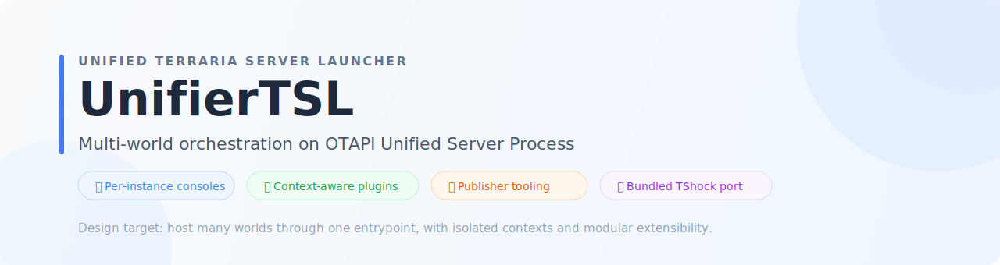
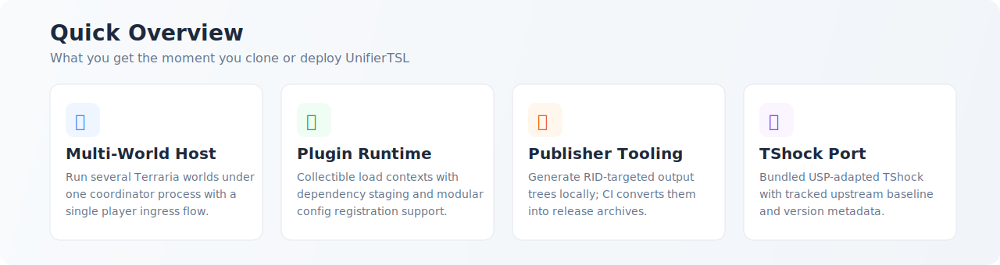
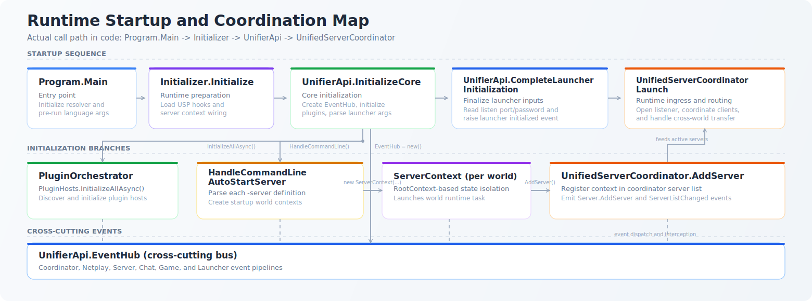
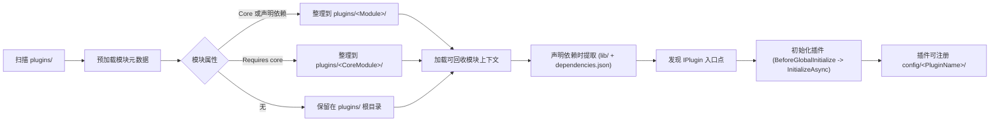

# UnifierTSL

> Languages: [English](../README.md) | [简体中文](./README.zh-cn.md)

<p align="center">
  
</p>

<p align="center">
  <a href="#quick-start"></a>
  <a href="https://github.com/CedaryCat/UnifierTSL/releases"></a>
  <a href="./dev-plugin.zh-cn.md"></a>
  <a href="#architecture"></a>
</p>

<p align="center">
  <a href="https://github.com/CedaryCat/UnifierTSL/actions/workflows/build.yaml"></a>
  <a href="https://github.com/CedaryCat/UnifierTSL/actions/workflows/docs-check.yaml"></a>
  <a href="../src/UnifierTSL.slnx"></a>
  <a href="../LICENSE"></a>
</p>

<p align="center">
  <em>在一个启动器里托管多个 Terraria 世界，<br>让每个世界在独立上下文里并行运行，并把路由、数据互通和插件扩展都留在同一个 OTAPI USP 运行时里处理。</em>
</p>

---

<p align="center">
  
</p>

## 📑 目录

- [概览](#overview)
- [核心能力](#core-capabilities)
- [版本矩阵](#version-matrix)
- [架构](#architecture)
- [快速开始](#quick-start)
- [启动器参考](#launcher-reference)
- [Publisher 参考](#publisher-reference)
- [项目结构](#project-layout)
- [插件系统](#plugin-system)
- [开发者指南](#developer-guide)
- [资源](#resources)

---

<a id="overview"></a>
## 📖 概览

UnifierTSL 把 [OTAPI Unified Server Process](https://github.com/CedaryCat/OTAPI.UnifiedServerProcess) 封装成可直接使用的运行时，让你在**一个启动器进程里托管多个 Terraria 世界**。

在传统的多进程多世界架构中，构建彼此协作的世界集群通常意味着额外的跨进程路由、状态同步和序列化设计。玩家在实例间迁移往往依赖数据包中转和额外信道；当需要跨世界共享插件附加数据、临时状态或运行时对象时，也常常要把原本进程内可以直接处理的问题改写成协议和同步流程。

相比将这些协调逻辑放到进程边界之外的方案，Unifier 基于 OTAPI USP 把入服路由、世界切换和扩展钩子收敛在同一个运行时平面内，在设计之初就将世界间协调作为一等公民来实现。启动器负责统一管理多世界生命周期，让每个世界在各自的 `ServerContext` 中独立并行运行，并为每个世界切分出独立的控制台以保证 I/O 隔离。
`UnifiedServerCoordinator` 负责总体协调，`UnifierApi.EventHub` 传递事件流，`PluginHost.PluginOrchestrator` 负责插件宿主编排。
这种共享监听入口与协调平面的方式，减少了跨进程中转带来的额外开销与复杂度，既方便建立跨世界联动、数据互通和统一运维，也保留了足够的路由控制空间，用于定义默认入服目标并接管后续的世界切换流程。

从玩家视角看，它依然像一个普通的 Terraria 服务器入口：客户端只需要连到同一个监听端口，随后由 `UnifiedServerCoordinator` 在同一进程内把连接路由到目标世界；如果继续把这套模型往前推，你可以做出更偏玩法的形态：完全互通的多实例世界集群、按需加载/卸载区域分片的弹性世界，或为单个玩家定制逻辑和资源预算的私人世界。
这些是可达方向，尽管启动器目前并未直接提供这些开箱即用的默认能力；而这类较重实现也未必会放进启动器核心本体，但你仍可以期待后续在 `plugins/` 下逐步补上的可用示例插件。

---

<a id="core-capabilities"></a>
## ✨ 核心能力

| 特性 | 描述 |
|:--|:--|
| 🖥 **多世界协调** | 在一个运行时进程里同时拉起并隔离多个世界 |
| 🧱 **结构体瓦片存储** | 世界图格使用 `struct TileData` 取代 `ITile`，降低内存占用并提升读写效率 |
| 🔀 **实时路由控制** | 可设置默认入服策略，也能通过协调器事件动态重路由玩家 |
| 🔌 **插件托管** | 从 `plugins/` 加载 .NET 模块，并处理配置注册与依赖分发 |
| 📦 **可回收模块上下文** | `ModuleLoadContext` 提供可卸载插件域，并支持分阶段依赖处理 |
| 📝 **统一日志管线** | `UnifierApi.LogCore` 支持自定义过滤器、写入器与元数据注入 |
| 🛡 **内置 TShock 移植基线** | 内置适配 USP 的 TShock 基线，开箱可用 |
| 💻 **上下文级控制台隔离** | 默认为每个世界实例提供独立、自动重连的控制台窗口 IO，以及语义化 readline 提示与实时状态栏 |
| 🚀 **按 RID 发布** | Publisher 生成可复现、面向目标运行时的目录结构 |

---

<a id="version-matrix"></a>
## 📊 版本矩阵

<!-- BEGIN:version-matrix -->
下面这些基线值直接来自仓库内项目文件与该仓库实际使用的已还原包资产：

| 组件 | 版本 | 来源 |
|:--|:--|:--|
| 目标框架 | `.NET 9.0` | `src/UnifierTSL/*.csproj` |
| Terraria | `1.4.5.6` | 通过 `src/UnifierTSL/obj/project.assets.json` 定位已还原的 `OTAPI.dll`（程序集文件版本） |
| OTAPI USP | `1.1.0-pre-release-upstream.30` | `src/UnifierTSL/UnifierTSL.csproj` |

<details>
<summary><strong>TShock 与依赖详情</strong></summary>

| 项目 | 值 |
|:--|:--|
| 内置 TShock 版本 | `6.1.0` |
| 同步分支 | `general-devel` |
| 同步提交 | `1afaeb514343ca547abceeb357654603d1e2a456` |
| 来源 | `src/Plugins/TShockAPI/TShockAPI.csproj` |

附加依赖版本：

| 包 | 版本 | 来源 |
|:--|:--|:--|
| ModFramework | `1.1.15` | `src/UnifierTSL/UnifierTSL.csproj` |
| MonoMod.RuntimeDetour | `25.2.3` | `src/UnifierTSL/UnifierTSL.csproj` |
| Tomlyn | `0.19.0` | `src/UnifierTSL/UnifierTSL.csproj` |
| linq2db | `5.4.1` | `src/UnifierTSL/UnifierTSL.csproj` |
| Microsoft.Data.Sqlite | `9.0.0` | `src/UnifierTSL/UnifierTSL.csproj` |

</details>
<!-- END:version-matrix -->

---

<a id="architecture"></a>
## 🏗 架构

<p align="center">
  
</p>

如果你想先看真实启动顺序，可以直接从这里开始：

1. `Program.Main` 初始化程序集解析器，应用启动前 CLI 语言覆盖，并输出运行时版本信息。
2. `Initializer.Initialize()` 准备 Terraria/USP 运行时状态，加载核心钩子（`UnifiedNetworkPatcher`、`UnifiedServerCoordinator`、`ServerContext` 初始化）。
3. `UnifierApi.PrepareRuntime(args)` 加载 `config/config.json`，把启动器文件配置与 CLI 覆盖合并，并配置持久日志后端。
4. `UnifierApi.InitializeCore()` 创建 `EventHub`、构建 `PluginOrchestrator`、执行 `PluginHosts.InitializeAllAsync()`、安装启动器控制台宿主（默认是 `TerminalLauncherConsoleHost`），并应用已解析的启动器默认值（入服模式 + 初始自动启动世界）。
5. `UnifierApi.CompleteLauncherInitialization()` 补全交互式监听端口/密码输入，同步最终生效的运行时快照，并触发启动器初始化事件。
6. `UnifiedServerCoordinator.Launch(...)` 打开共享监听；随后 `UnifierApi.StartRootConfigMonitoring()` 才会启用根配置热重载，接着更新标题、触发协调器已启动事件并进入聊天输入循环。

<details>
<summary><strong>运行时组件分工</strong></summary>

| 组件 | 职责 |
|:--|:--|
| `Program.cs` | 启动启动器并完成运行时引导 |
| `UnifierApi` | 初始化事件中心、插件编排和启动参数处理 |
| `UnifiedServerCoordinator` | 管理监听套接字、客户端协调和跨世界路由 |
| `ServerContext` | 维护每个托管世界各自隔离的运行时状态 |
| `PluginHost` + 模块加载器 | 负责插件发现、加载和依赖分发 |

</details>

### 角色入口

如果你已经知道自己是来干什么的，可以直接从对应入口跳：

| 角色 | 从这里开始 | 原因 |
|:--|:--|:--|
| 🖥 服主/运维 | [快速开始 ↓](#quick-start) | 用最少配置把多世界宿主先跑起来 |
| 🔌 插件开发者 | [插件开发指南](./dev-plugin.zh-cn.md) | 沿用启动器同源的配置/事件/依赖流程来开发和迁移模块 |

---

<a id="quick-start"></a>
## 🚀 快速开始

如果你的目标很简单，就是“先把启动器跑起来，看着世界上线”，那就从这里开始。

### 前置要求

按你的使用方式准备对应依赖：

| 工作流 | 要求 |
|:--|:--|
| **仅使用发布包** | 目标主机安装 [.NET 9 Runtime](https://dotnet.microsoft.com/download/dotnet/9.0) |
| **源码运行 / Publisher** | 安装 [.NET 9 SDK](https://dotnet.microsoft.com/download/dotnet/9.0) 且 `PATH` 中可用 `msgfmt`（用于 `.mo` 文件） |

### 方案 A：使用发布包

如果你只是想先用起来，这是最短路径。

**1.** 从 [GitHub Releases](https://github.com/CedaryCat/UnifierTSL/releases) 下载与你平台匹配的发布资产：

| 平台 | 文件模式 |
|:--|:--|
| Windows | `utsl-<rid>-v<semver>.zip` |
| Linux / macOS | `utsl-<rid>-v<semver>.tar.gz` |

**2.** 解压并启动：

<details>
<summary><strong>Windows (PowerShell)</strong></summary>

```powershell
.\UnifierTSL.exe -lang 7 -port 7777 -password changeme `
  -server "name:S1 worldname:S1 gamemode:3 size:1 evil:0 seed:\"for the worthy\"" `
  -server "name:S2 worldname:S2 gamemode:2 size:2" `
  -joinserver first
```

> **Windows 提示（SmartScreen/Defender 信誉）：**
> 在部分机器上，首次启动 `app/UnifierTSL.ConsoleClient.exe` 可能被识别为未知发布者或未识别应用并被拦截。
> 如果发生，主启动器控制台可能看起来卡在加载状态，因为它会持续重试拉起每世界控制台进程。
> 允许该可执行文件（或信任解压目录）后，重新启动 `UnifierTSL.exe`。

</details>

<details>
<summary><strong>Linux / macOS</strong></summary>

```bash
chmod +x UnifierTSL
./UnifierTSL -lang 7 -port 7777 -password changeme \
  -server "name:S1 worldname:S1 gamemode:3 size:1 evil:0 seed:\"for the worthy\"" \
  -joinserver first
```

</details>

### 方案 B：从源码运行

如果你要本地调试、接 CI，或者自己控制 Publisher 产物，就走这个方式。

**1.** 克隆并还原依赖：

```bash
git clone https://github.com/CedaryCat/UnifierTSL.git
cd UnifierTSL
dotnet restore src/UnifierTSL.slnx
```

**2.** 构建：

```bash
dotnet build src/UnifierTSL.slnx -c Debug
```

**3.** （可选）生成本地 Publisher 产物：

```bash
dotnet run --project src/UnifierTSL.Publisher/UnifierTSL.Publisher.csproj -- \
  --excluded-plugins ExamplePlugin,ExamplePlugin.Features
```

如果省略 `--rid`，Publisher 会自动推断当前主机的 RID。若你希望产物命名和打包过程更可复现，或是在文档/脚本里明确目标平台，仍建议显式传入，例如 `--rid win-x64`。

**4.** 做一次启动冒烟测试：

```bash
dotnet run --project src/UnifierTSL/UnifierTSL.csproj -- \
  -port 7777 -password changeme \
  -server "name:Dev worldname:Dev" \
  -joinserver first
```

> **说明**：Publisher 默认输出目录为 `src/UnifierTSL.Publisher/bin/<Configuration>/net9.0/utsl-<rid>/`。
> `UnifierTSL.ConsoleClient` 只需要由启动器拉起，管道参数会自动注入。

**5.** （可选，最简单的 Visual Studio 调试流）直接使用仓库内置启动配置：

1. 将启动项目切换为 `UnifierTSL.Publisher`，先运行一次。
2. 仓库内置的 Publisher 启动配置会使用 `--use-rid-folder false --clean-output-dir false --output-path "utsl-publish"`，因此输出目录是 `src/UnifierTSL.Publisher/bin/Debug/net9.0/utsl-publish/`，而不是 `utsl-<rid>`。
3. 随后把启动项目切换为 `UnifierTSL`，选择 `Executable` 启动配置并开始调试。
4. 该配置会直接从 `utsl-publish` 运行发布后的启动器，并对该已发布程序附加调试。

### 首次启动后会发生什么

- 第一次成功启动后，`config/config.json` 会自动生成，并保存当前生效的启动器启动快照。不过对你这一次启动来说，CLI 参数仍然优先。
- 插件配置统一落在 `config/<PluginName>/` 下。对内置 TShock 来说，配置根目录是 `config/TShockAPI/`；这同时也是其他 TShock 相关运行时文件的保存位置，例如启用 SQLite 时的 `tshock.sqlite` 也会放在这里，所以实际用起来它基本就等同于原版独立 TShock 程序目录下的 `tshock/` 文件夹。
- 发布产物一开始是平铺的 `plugins/` 目录。启动过程中如果模块声明了核心模块或依赖元数据，加载器会按需要把它们重组到子目录里。
- 如果一切正常，你会看到共享监听端口绑定成功、目标世界启动、启动器状态输出开始刷新，并且在默认控制台 IO 实现下，每个世界都会弹出自己的独立控制台窗口。

### 内置 TShock 说明

- 这里内置的 TShock 是面向 UnifierTSL / OTAPI USP 运行时的移植实现。底层会优先使用 UTSL/USP 原生提供的运行时接口、事件系统、数据包模型等通用能力来重实现相关逻辑，不会额外维持一套兼容层，但仍会尽力让 TShock 上层功能的行为与使用体验保持和原来一致，并适配多世界同进程运行模型。
- 这个移植会持续跟随上游 TShock 的进度进行迁移更新。当前跟踪的移植基线可以直接在 `src/Plugins/TShockAPI/TShockAPI.csproj` 里查看，例如 `MainlineSyncBranch`、`MainlineSyncCommit` 和 `MainlineVersion`。
- 启动器设置固定在 `config/config.json`，而内置 TShock 使用 `config/TShockAPI/` 下的独立配置和数据目录，不和启动器根配置混用；这也同时是其他 TShock 相关运行时文件的保存位置，例如启用 SQLite 时的 `tshock.sqlite` 也会放在这里，所以这个目录基本就相当于原版独立 TShock 程序目录下的 `tshock/` 文件夹。
- `config/TShockAPI/config.json` 保存全局默认值，`config/TShockAPI/config.override.json` 以已配置的服务器名为键保存分服覆盖补丁，例如 `"S1": { "MaxSlots": 16 }`；`config/TShockAPI/sscconfig.json` 仍然独立负责 SSC 设置。
- 由于运行时会同时承载多个世界，一些在原版单世界流程里通常依赖“当前世界”隐式决定的数据访问，在这里会改成显式带上 world 上下文；例如 warp 相关代码逻辑在查找或修改条目时会显式使用 `worldId`。
- 直接编辑 `config.json` 或 `config.override.json` 会触发配置句柄监听，并重新应用运行中的 TShock 服务器设置；`/reload` 仍然有意义，因为它还会额外刷新权限、区域、封禁、白名单等状态，并走 TShock 传统 reload 流程。部分改动依旧需要重启。
- 最后，也感谢 TShock 项目及其贡献者长期积累下来的功能、设计和社区生态；这个移植建立在这些工作的基础之上。

---

<a id="launcher-reference"></a>
## 🎮 启动器参考

### 命令行参数

| 参数 | 描述 | 可接受值 | 默认值 |
|:--|:--|:--|:--|
| `-listen`, `-port` | 协调器 TCP 端口 | 整数 | 从 STDIN 交互读取 |
| `-password` | 共享客户端密码 | 任意字符串 | 从 STDIN 交互读取 |
| `-autostart`, `-addserver`, `-server` | 添加服务器定义 | 可重复 `key:value` 组 | — |
| `-servermerge`, `--server-merge`, `--auto-start-merge` | CLI `-server` 与配置的合并策略 | `replace` / `overwrite` / `append` | `replace` |
| `-joinserver` | 默认入服策略 | `first` / `f` / `random` / `rnd` / `r` | — |
| `-logmode`, `--log-mode` | 启动器持久日志后端 | `txt` / `none` / `sqlite` | `txt` |
| `-colorful`, `--colorful`, `--no-colorful` | 控制交互式终端中的鲜艳 ANSI 状态栏渲染 | `true` / `false`、`on` / `off`、`1` / `0`；`--no-colorful` 直接关闭 | `true` |
| `-culture`, `-lang`, `-language` | 覆盖 Terraria 语言 | 旧 culture ID 或名称 | 主机 culture |

> **提示**：如果插件没有通过 `EventHub.Coordinator.SwitchJoinServer` 接管入服，建议直接使用 `-joinserver first` 或 `random`。

### 启动器配置文件

启动器根配置固定为 `config/config.json`。它与插件配置（`config/<PluginName>/...`）分离，旧的根目录 `config.json` 会被明确忽略。

启动时优先级如下：

1. `config/config.json`
2. CLI 覆盖（并将启动时生效快照回写到 `config/config.json`）
3. 仅对缺失端口/密码进行交互式补全

在交互式终端中，缺失端口/密码的补全会使用语义化 readline，提供 ghost 文本、候选轮换和实时校验/状态行；非交互宿主会自动回退。

`launcher.consoleStatus` 用于控制命令行状态栏渲染。`launcher.colorfulConsoleStatus` 仍然负责鲜艳 ANSI 配色，而 `launcher.consoleStatus.bandwidthUnit` 用于选择带宽显示单位族：`bytes` 显示 `KB/s -> MB/s -> GB/s -> TB/s`（默认），`bits` 显示 `Kbps -> Mbps -> Gbps -> Tbps`；`launcher.consoleStatus.bandwidthRolloverThreshold` 用于控制何时向上进位到下一个单位（默认 `500.0`）。

<details>
<summary><strong>默认控制台状态值</strong></summary>

| 键 | 单位 | 默认值 | 描述 |
|:--|:--|:--|:--|
| `targetUps` | UPS | `60.0` | 作为 TPS 健康判断基线的目标更新速率 |
| `healthyUpsDeviation` | UPS 偏差 | `2.0` | 相对 `targetUps` 的绝对偏差不超过该值时仍视为健康 |
| `warningUpsDeviation` | UPS 偏差 | `5.0` | 相对 `targetUps` 的绝对偏差不超过该值时视为警告，再高则转为异常 |
| `utilHealthyMax` | 比例（`0.0`-`1.0`） | `0.55` | 忙碌利用率不高于该值时仍视为健康 |
| `utilWarningMax` | 比例（`0.0`-`1.0`） | `0.80` | 忙碌利用率不高于该值时视为警告，再高则转为异常 |
| `onlineWarnRemainingSlots` | 槽位数 | `5` | 剩余玩家槽位小于等于该值时，在线指标转为警告 |
| `onlineBadRemainingSlots` | 槽位数 | `0` | 剩余玩家槽位小于等于该值时，在线指标转为异常/满员 |
| `bandwidthUnit` | 枚举 | `bytes` | 带宽显示单位族：`bytes`（`KB/s -> MB/s -> GB/s -> TB/s`）或 `bits`（`Kbps -> Mbps -> Gbps -> Tbps`） |
| `bandwidthRolloverThreshold` | 当前显示单位 | `500.0` | 数值达到或超过该阈值时，格式化器会进位到下一个带宽单位 |
| `upWarnKBps` | KB/s | `800.0` | Server 上行带宽达到该阈值时，网络指标转为警告 |
| `upBadKBps` | KB/s | `1600.0` | Server 上行带宽达到该阈值时，网络指标转为异常 |
| `downWarnKBps` | KB/s | `50.0` | Server 下行带宽达到该阈值时，网络指标转为警告 |
| `downBadKBps` | KB/s | `100.0` | Server 下行带宽达到该阈值时，网络指标转为异常 |
| `launcherUpWarnKBps` | KB/s | `2400.0` | Launcher 上行带宽达到该阈值时，网络指标转为警告 |
| `launcherUpBadKBps` | KB/s | `4800.0` | Launcher 上行带宽达到该阈值时，网络指标转为异常 |
| `launcherDownWarnKBps` | KB/s | `150.0` | Launcher 下行带宽达到该阈值时，网络指标转为警告 |
| `launcherDownBadKBps` | KB/s | `300.0` | Launcher 下行带宽达到该阈值时，网络指标转为异常 |

</details>

在 `UnifiedServerCoordinator.Launch(...)` 成功后，启动器会开始监视 `config/config.json`，只做安全范围内的热重载：

- 立即生效：`launcher.serverPassword`、`launcher.joinServer`、追加式 `launcher.autoStartServers`、`launcher.listenPort`（监听器重绑）、`launcher.colorfulConsoleStatus`、`launcher.consoleStatus`

### 服务器定义键

每个 `-server` 值由空白分隔的 `key:value` 组成，实际由 `LauncherRuntimeOps` 在启动配置合并阶段解析：

| 键 | 用途 | 可接受值 | 默认值 |
|:--|:--|:--|:--|
| `name` | 友好服务器标识 | 唯一字符串 | *必填* |
| `worldname` | 加载或生成的世界名 | 唯一字符串 | *必填* |
| `seed` | 生成种子 | 任意字符串 | — |
| `gamemode` / `difficulty` | 世界难度 | `0`–`3`, `normal`, `expert`, `master`, `creative` | `master` |
| `size` | 世界尺寸 | `1`–`3`, `small`, `medium`, `large` | `large` |
| `evil` | 世界邪恶类型 | `0`–`2`, `random`, `corruption`, `crimson` | `random` |

`-servermerge` 行为：

- `replace`（默认）：干净替换；配置里未在 CLI 出现的项会被移除。
- `overwrite`：保留配置项，但 CLI 中同名 `name` 会覆盖配置项。
- `append`：保留配置项，只追加配置中不存在同名 `name` 的 CLI 项。
- 对 `worldname` 冲突会按优先级保留高优先项，低优先项会 warning 并忽略。

---

<a id="publisher-reference"></a>
## 📦 Publisher 参考

### CLI 参数

| 参数 | 描述 | 取值 | 默认值 |
|:--|:--|:--|:--|
| `--rid` | 目标运行时标识符；省略时会自动推断当前主机 RID，但仍建议显式填写 | 例如 `win-x64`, `linux-x64`, `osx-x64` | 自动从当前主机推断 |
| `--excluded-plugins` | 要跳过的插件项目 | 逗号分隔或重复传入 | — |
| `--output-path` | 输出根目录 | 绝对或相对路径 | `src/.../bin/<Config>/net9.0` |
| `--use-rid-folder` | 是否追加 `utsl-<rid>` 子目录 | `true` / `false` | `true` |
| `--clean-output-dir` | 输出前清空已有目录 | `true` / `false` | `true` |

Publisher 生成 framework-dependent 产物（`SelfContained=false`）。

### 输出生命周期

<details>
<summary><strong>Publisher 初始输出（本地）</strong></summary>

Publisher 会生成目录树（不是归档）：

```
utsl-<rid>/
├── UnifierTSL(.exe)
├── UnifierTSL.pdb
├── app/
│   ├── UnifierTSL.ConsoleClient(.exe)
│   └── UnifierTSL.ConsoleClient.pdb
├── i18n/
├── lib/
├── plugins/
│   ├── TShockAPI.dll
│   ├── TShockAPI.pdb
│   ├── CommandTeleport.dll
│   └── CommandTeleport.pdb
└── runtimes/
```

</details>

<details>
<summary><strong>首次启动后重排的插件布局</strong></summary>

启动阶段，模块加载器会根据属性（`[CoreModule]`、`[RequiresCoreModule]`、依赖声明）重排插件文件：

```
plugins/
├── TShockAPI/
│   ├── TShockAPI.dll
│   ├── dependencies.json
│   └── lib/
└── CommandTeleport.dll

config/
├── config.json
├── TShockAPI/
└── CommandTeleport/
```

`dependencies.json` 会在模块加载时由依赖分发逻辑生成或更新。

</details>

<details>
<summary><strong>CI 构建产物与发布命名</strong></summary>

GitHub Actions 采用两层命名：

| 层级 | 模式 |
|:--|:--|
| Workflow artifact | `utsl-<rid>-<semver>` |
| Release 归档（Windows） | `utsl-<rid>-v<semver>.zip` |
| Release 归档（Linux/macOS） | `utsl-<rid>-v<semver>.tar.gz` |

</details>

---

<a id="project-layout"></a>
## 🗂 项目结构

| 组件 | 作用 |
|:--|:--|
| **Launcher** (`UnifierTSL`) | 运行时入口，负责世界引导、路由和协调器生命周期 |
| **Console Client** (`UnifierTSL.ConsoleClient`) | 每个世界一个独立控制台进程，通过命名管道连接 |
| **Publisher** (`UnifierTSL.Publisher`) | 按 RID 生成可部署目录产物 |
| **Plugins** (`src/Plugins/`) | 仓库维护的模块（TShockAPI、CommandTeleport、示例） |
| **Docs** (`docs/`) | 运行时、插件和迁移相关文档 |

```text
.
├── src/
│   ├── UnifierTSL.slnx
│   ├── UnifierTSL/
│   │   ├── Module/
│   │   ├── PluginHost/
│   │   ├── Servers/
│   │   ├── Network/
│   │   └── Logging/
│   ├── UnifierTSL.ConsoleClient/
│   ├── UnifierTSL.Publisher/
│   └── Plugins/
│       ├── TShockAPI/
│       ├── CommandTeleport/
│       ├── ExamplePlugin/
│       └── ExamplePlugin.Features/
└── docs/
```

---

<a id="plugin-system"></a>
## 🔌 插件系统

### 插件加载流程


```mermaid
graph LR
    A["扫描 plugins/"] --> B["预加载模块元数据"]
    B --> C{"模块属性"}
    C -->|Core 或声明依赖| D["整理到 plugins/&lt;Module&gt;/"]
    C -->|Requires core| E["整理到 plugins/&lt;CoreModule&gt;/"]
    C -->|无| F["保留在 plugins/ 根目录"]
    D --> G["加载可回收模块上下文"]
    E --> G
    F --> G
    G --> H["声明依赖时提取 (lib/ + dependencies.json)"]
    H --> I["发现 IPlugin 入口点"]
    I --> J["初始化插件 (BeforeGlobalInitialize -> InitializeAsync)"]
    J --> K["插件可注册 config/&lt;PluginName&gt;/"]
```

### 关键概念

| 概念 | 描述 |
|:--|:--|
| **模块预加载** | `ModuleAssemblyLoader` 会在插件实例化前读取程序集元数据并整理文件位置 |
| **`[CoreModule]`** | 标记模块进入专属目录，并作为核心模块上下文锚点 |
| **`[RequiresCoreModule("...")]`** | 让模块在指定核心模块上下文下加载 |
| **依赖分发** | 声明依赖的模块会提取到 `lib/`，并在 `dependencies.json` 里记录状态 |
| **插件初始化** | Dotnet 宿主会按顺序先执行 `BeforeGlobalInitialize`，再执行 `InitializeAsync` |
| **配置注册** | 配置存放在 `config/<PluginName>/`，支持自动重载（`TriggerReloadOnExternalChange(true)`） |
| **可回收上下文** | `ModuleLoadContext` 支持可卸载的插件域 |

→ 完整指南：[插件开发指南](./dev-plugin.zh-cn.md)

---

<a id="developer-guide"></a>
## 🛠 开发者指南

### 常用命令

```bash
# 还原依赖
dotnet restore src/UnifierTSL.slnx

# 构建（Debug）
dotnet build src/UnifierTSL.slnx -c Debug

# 启动器测试运行
dotnet run --project src/UnifierTSL/UnifierTSL.csproj -- \
  -port 7777 -password changeme -joinserver first

# 为当前主机生成发布目录（自动推断 RID）
dotnet run --project src/UnifierTSL.Publisher/UnifierTSL.Publisher.csproj -- \
  --excluded-plugins ExamplePlugin,ExamplePlugin.Features

# 为指定 RID 生成发布目录（更推荐用于可复现打包）
dotnet run --project src/UnifierTSL.Publisher/UnifierTSL.Publisher.csproj -- \
  --rid win-x64
```

### 支持平台

下表反映的是当前维护/文档化的打包目标，而不是 Publisher 理论上可以尝试推断的全部 RID。

| RID | 状态 |
|:--|:--|
| `win-x64` | ✅ 支持 |
| `linux-x64` | ✅ 支持 |
| `linux-arm64` | ❌ 暂不支持 |
| `linux-arm` | ⚠️ 部分支持 / 仍需人工验证 |
| `osx-x64` | ✅ 支持 |

---

<a id="resources"></a>
## 📚 资源

| 资源 | 链接 |
|:--|:--|
| 开发者总览 | [docs/dev-overview.zh-cn.md](./dev-overview.zh-cn.md) |
| 插件开发指南 | [docs/dev-plugin.zh-cn.md](./dev-plugin.zh-cn.md) |
| 分支工作流指南 | [docs/branch-setup-guide.zh-cn.md](./branch-setup-guide.zh-cn.md) |
| 分支工作流速查 | [docs/branch-strategy-quick-reference.zh-cn.md](./branch-strategy-quick-reference.zh-cn.md) |
| OTAPI Unified Server Process | [GitHub](https://github.com/CedaryCat/OTAPI.UnifiedServerProcess) |
| 上游 TShock | [GitHub](https://github.com/Pryaxis/TShock) |
| DeepWiki AI 分析 | [deepwiki.com](https://deepwiki.com/CedaryCat/UnifierTSL) *(仅供参考)* |

---

<p align="center">
  <sub>Made with ❤️ by the UnifierTSL contributors · Licensed under GPL-3.0</sub>
</p>
